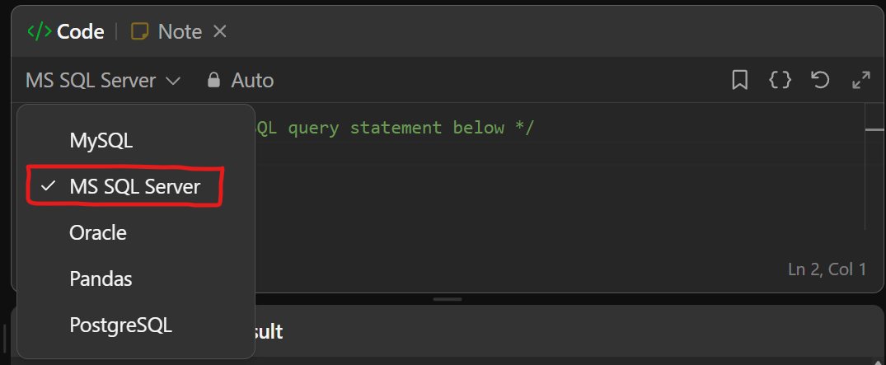

# **Assignment 2: Hands-on SQL Problem Solving**

## **Objective**

In this assignment, you will practice writing SQL queries over a university database schema and reinforce your SQL fundamentals by solving online problems.

## **Part 1: SQL Queries Using the University Schema** 
### **Step 1: Create the Database and Tables**

Run the provided **SQL script** ([`university.sql`](../assets/scripts/university.sql)) to create the database schema and populate it with sample data.
### **Step 2: Write SQL Queries**

a. Find the ID and name of each student who has taken at least one **Comp. Sci.** course. Make sure there are **no duplicate names** in the result.

b. For each department, find the **maximum salary of instructors** in that department. You may assume that every department has at least one instructor.

c. Find the **lowest**, across all departments, of the **per-department maximum salary** computed in the previous query. ( can be solved using subquery? )
	_Hint: This can also be solved using the `WITH` clause. Try researching how it works!_

## **Part 2: LeetCode Practice**

Before you begin, make sure to **select `MS SQL Server`** as the SQL dialect in LeetCode:  

Then, solve the following **5 SQL problems** on LeetCode:
1. [Recyclable and Low Fat Products](https://leetcode.com/problems/recyclable-and-low-fat-products/)
2. [Find Customer Referee](https://leetcode.com/problems/find-customer-referee/)  
    _follow up: Search for `IS FALSE` and `IS NOT FALSE` to better understand the logic used in this problem._
3. [Big Countries](https://leetcode.com/problems/big-countries/)
4. [Article Views I](https://leetcode.com/problems/article-views-i/)
5. [Invalid Tweets](https://leetcode.com/problems/invalid-tweets/)  
    _Hint: You might need to search for SQL Server-specific string functions._

> **Note:** The `IS FALSE` and `IS NOT FALSE` syntax is not supported in **MS SQL Server**. If you want to test solutions using these expressions, **temporarily switch the SQL dialect to `MySQL`** in LeetCode.

## **Submission Guidelines**

Please follow the instructions below carefully to prepare and submit your assignment:
1. **Create a PDF file** named using your full name.  
    **Example**: `AbdElrahman_Rabea.pdf`
    
2. Your PDF should be organized as follows:
    - **Page 1**:  
        Include your personal details:
        - **Full Name**,  **Student ID**,  **Department**
    - **Page 2**:  
        Write your **solutions for Part 1** (the university schema SQL queries). Make sure to format your SQL code clearly and include screenshots of query results.
    - **Page 3**:  
        Add **screenshots** of your attempts or solutions for the **5 LeetCode problems** listed in Part 2. Each problem should have its own labeled section (e.g., "Recyclable and Low Fat Products").
        
3. Once completed, **submit your PDF file** [here](https://forms.gle/jEHBL924agA1hvJq5) by **30/4/2025**.
